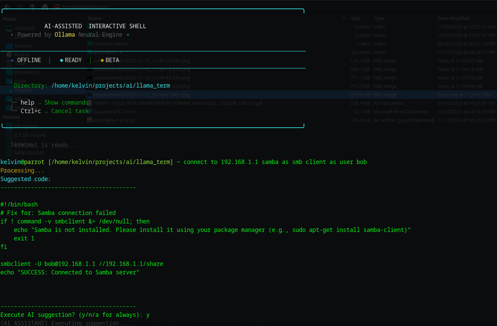

# llama_term

An Ai driven python script that operates as Linux terminal through the help from a local ollama model.


## How it works

The process is simple:

**command → execute**

When that fails:

**command → execute → ai prompted → user prompted → execute the script**

The terminal is not an actual compiled shell, but it emulates what's mostly done in a terminal.

The terminal is mostly for UNIX systems (but might also work with Windows).

## Settings

You may set:

- `OLLAMA_MODEL` (Default: `qwen2.5-coder:3b`)
- `BASE_DIR`
- `HISTORY_LINES` (How many added history to be stored in lines)

## Hallucinations
As the model thought that was the way for smb login (reviewing the scripts can show). Running `BUMP()` in terminal may fix some issues by clearing the context in background (you can modify the HISTORY_LINES and modify the prompt in `history` for a tailored or a more accurate experience, but provide some examples for the model).

## Variables

A Python approach has been used instead: the usage of `{}` instead of `$`.


## Usage

Just run:

```bash
git clone https://github.com/Kevinscki/llama_term.git
cd llama_term
chmod +x ./install.sh
./install.sh  
python3 llama_shell.py
```

Install `pip3 install prompt-toolkit`.
If any issues run this:
```bash
python3 -m venv .env #create the python environment (I dont advise using --break-system-packages)
source ./.env/bin/activate
pip3 install prompt-toolkit
python3 llama_shell.py
```
## Testing

Tell the model to find a flag to test if the model runs correctly.
