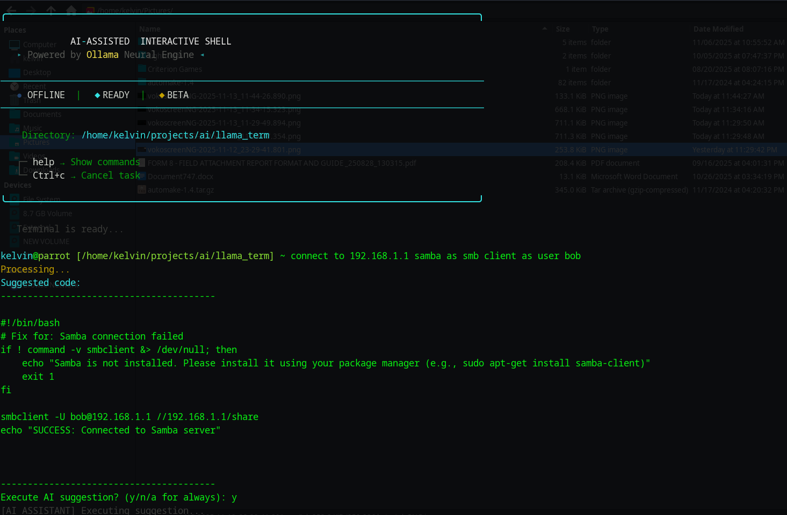

# llama_term

An Ai driven python script that operates as Linux terminal through the help from a local ollama model.


## How it works

The process is simple:

**command → execute**

When that fails:

**command → execute → ai prompted → user prompted → execute the script**

The terminal is not an actual compiled shell, but it emulates what's mostly done in a terminal.

The terminal is mostly for UNIX systems (but might also work with Windows).

## Settings

You may set:

- `OLLAMA_MODEL`
- `BASE_DIR`
- `HISTORY_LINES`


## Hallucinations
As the model can get to think something weird (reviewing the scripts given can show). Running `BUMP()` in terminal may fix some issues by clearing the context in background. You can modify the `HISTORY_LINES` and modify the prompt in `history/log_bash.txt or history/log_windows.txt` for a tailored or a more accurate experience, but provide some examples for the model.
You can also preload the model by typing `LOAD()` before sending any other prompts.
## Variables

Variables will be stored in persistence just like a linux shell, The ai owever will not access the variables.

## Requirements
Make sure you have `ollama` installed either by snap or from the official website. You can download with `ollama pull`, a model suitable for your machine and needs and replace the `OLLAMA_MODEL` variable
## Usage

Just run:

```bash
git clone https://github.com/Kevinscki/llama_term.git
cd llama_term
python3 -m venv .env #create the python environment (I dont advise using --break-system-packages)
source ./.env/bin/activate
pip3 install prompt-toolkit
python3 llama_shell.py
```
You can utilize the `Modelfile` to try a slightly modified version of your model. you can then rename the model similar to the `OLLAMA_MODEL` variable in  `configuration_variables.py`.

Example:

```bash
ollama create bash_model -f Modelfile #Modelfile contains the base model to be used in creating the other model
ollama list #Your new modified model will show up
```

## Testing

Tell the model to list files or find a file, observe the code after.
